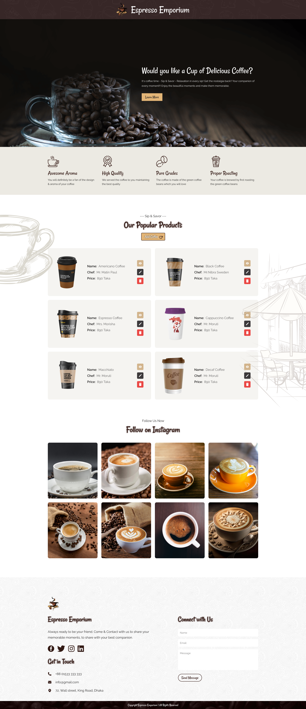

# ☕ Coffee Collection App

**Coffee Collection** is a full-stack web application built to manage a dynamic inventory of coffee products. Users can add, view, update, and delete coffee items through an intuitive interface. This app is ideal for small cafes or enthusiasts looking to showcase and organize coffee selections.

## 🚀 Features

- Add new coffee items with image upload
- View a list of all coffee products with details
- Update existing coffee data
- Delete coffee items with confirmation prompt
- Fully responsive and modern UI with Tailwind CSS
- Image upload support via `multipart/form-data`
- Smooth user experience with loading states and alerts (SweetAlert2)

## 🛠 Tech Stack

**Frontend:**

- React
- React Router DOM
- Tailwind CSS
- DaisyUI
- SweetAlert2

**Backend:**

- Express.js
- MongoDB
- Multer (for handling image uploads)

## 📁 Folder Structure Highlights

- `/client` – React frontend
- `/server` – Express backend with REST API endpoints
- `public/resources/images` – UI design assets and decorative elements

## 📷 Screenshots

#### Landing Page


#### Add Coffee Page


#### View Page


## 📦 Setup Instructions

1. Clone the repository.
2. Run the backend server:
   ```bash
   cd server
   npm install
   npm run dev
   ```
3. Run the frontend:
   ```bash
   cd client
   npm install
   npm run dev
   ```
4. Ensure MongoDB is running locally or use a MongoDB Atlas connection string.
5. Enjoy managing your coffee collection!


### Credit: Resources from Programming Hero
