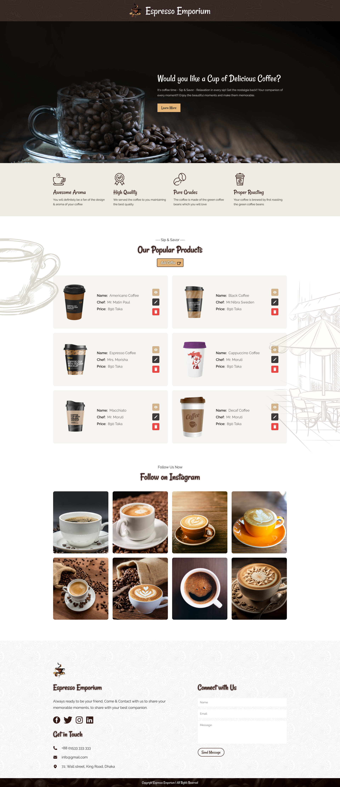
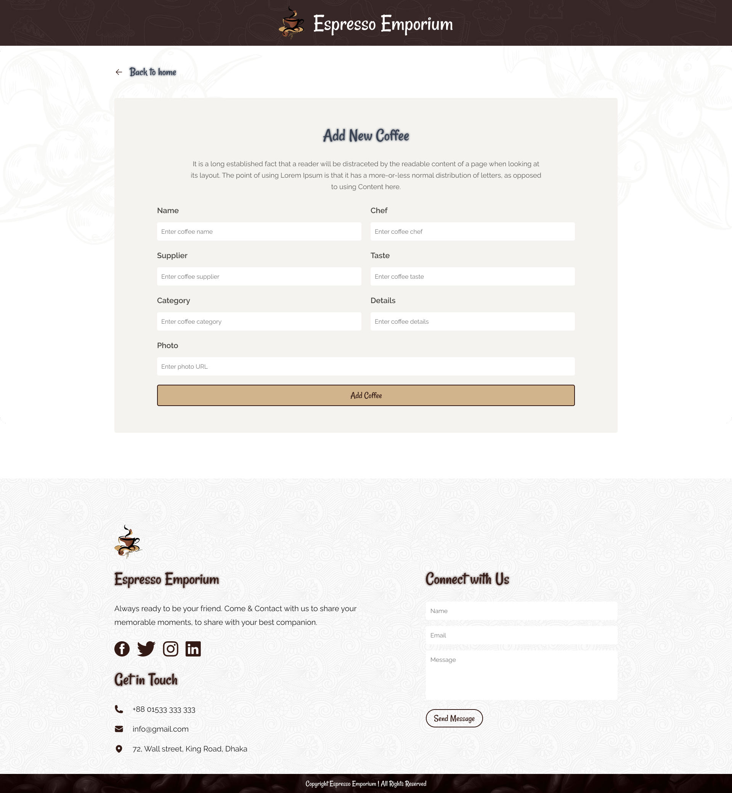
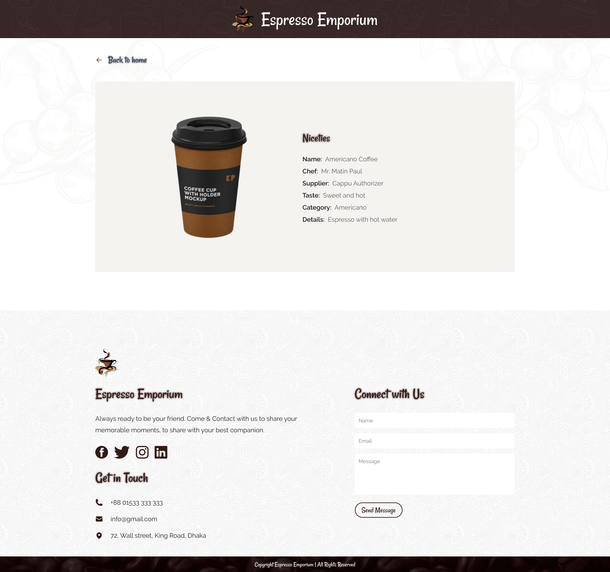

# ☕ Coffee Collection App

**Coffee Collection** is a full-stack web application built to manage a dynamic inventory of coffee products. Users can add, view, update, and delete coffee items through an intuitive interface. This app is ideal for small cafes or enthusiasts looking to showcase and organize coffee selections.

## 🌐 Deployed Links (Vercel)

- Frontend (Production): https://coffee-store-client-one.vercel.app/
- Backend (Production): https://espresso-emporium-server-rosy-nine.vercel.app/

> Note: If you see a **401 Unauthorized** page, Vercel “Deployment Protection / Vercel Authentication” is enabled for your team. Disable it in Vercel Project Settings → Deployment Protection to make the URLs public.

## 🚀 Features

- Add new coffee items with image upload
- View a list of all coffee products with details
- Update existing coffee data
- Delete coffee items with confirmation prompt
- Fully responsive and modern UI with Tailwind CSS
- Image upload support via `multipart/form-data`
- Smooth user experience with loading states and alerts (SweetAlert2)

## 🛠 Tech Stack

**Frontend:**

- React
- React Router DOM
- Tailwind CSS
- DaisyUI
- SweetAlert2

**Backend:**

- Express.js
- MongoDB
- Multer (for handling image uploads)

## 📁 Folder Structure Highlights

- `/coffee-store-client` – React frontend
- `/coffee-store-server` – Express backend with REST API endpoints
- `public/resources/images` – UI design assets and decorative elements

## 📷 Screenshots

#### Landing Page



#### Add Coffee Page



#### View Page



## 📦 Setup Instructions

1. Clone the repository.
2. Run the backend server:
    ```bash
    cd coffee-store-server
    npm install
    npm start
    ```
3. Run the frontend:
    ```bash
    cd coffee-store-client
    npm install
    npm run dev
    ```
4. Ensure MongoDB is running locally or use a MongoDB Atlas connection string.
5. (Optional) Seed 6 coffees (uses `coffee-store-client/public/resources/images/1.png`…`6.png`):
    ```bash
    cd coffee-store-server
    npm run seed
    ```
6. Enjoy managing your coffee collection!

### Credit: Resources from Programming Hero
